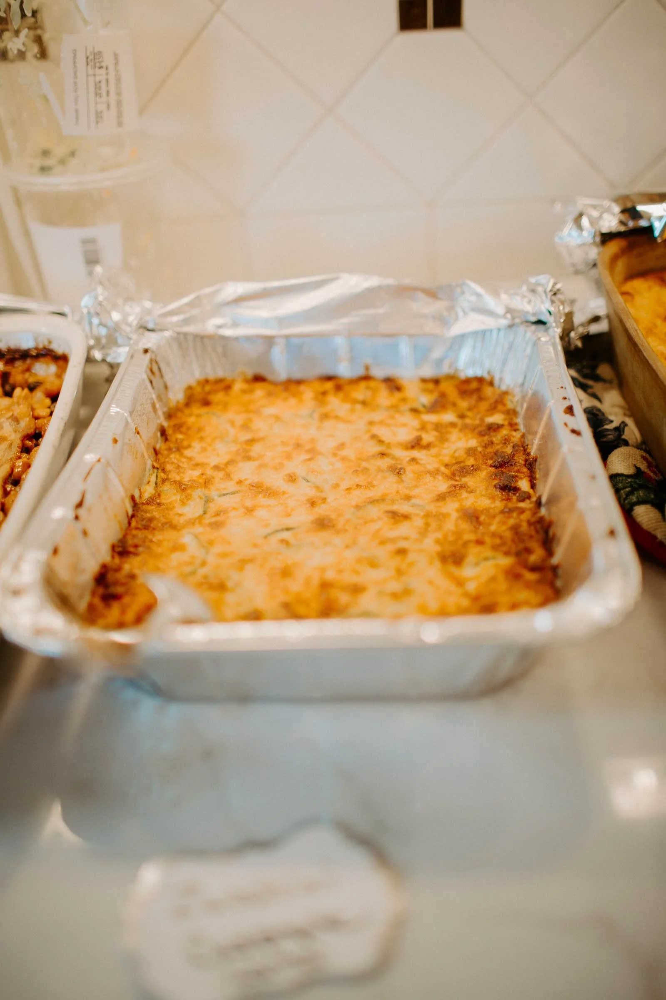

# Baked Zucchini Casserole

## Ingredients

- 3 small zucchini (4 cups sliced)
- 2 teaspoons kosher salt
- 2 Tablespoons olive oil
- 1 yellow onion, diced
- 2 cloves garlic, minced
- 1 green onion
- 1 cup heavy whipping cream
- 1 cup shredded cheddar cheese
- ¼ cup parmesan cheese, shredded
- ½ teaspoon ground black pepper
- 2 large eggs
- 1 ½ cups crumbled fresh mozzarella cheese (can also use shredded)

## Instructions

1. Preheat the oven to 400 degrees F.
1. Prepare the zucchini:
    1. Remove the top and bottom, and slice it thin.
    2. Place the zucchini slices in a large tray covered with a clean tea towel or paper towel.
    3. Sprinkle some salt on top so they’ll release excess water.
    4. Leave it for 10-15 minutes, and then repeat it on the other side.
    5. Dry the zucchini using a clean towel.
    6. Take a 9’’ round baking pan, and arrange ⅓ -¼ of the zucchini slices on the base. Set aside.
1. Add two tablespoons of olive oil into a skillet and sauté onion and garlic until fragrant (about 2 minutes). Add sliced green onion (the white part only) and stir until the onion is translucent.
1. To the skillet, over medium heat, add heavy cream, cheddar, and parmesan cheese; mix until smooth and slightly thickened. Remove from heat.
1. Season cheese mixture with ground black pepper, and add beaten eggs. Whisk to combine.
1. Cover the zucchini slices with creamy sauce and mozzarella cheese. Repeat two to three more layers with the rest of the zucchini, the sauce, and mozzarella cheese.
1. Bake this zucchini casserole for 20 minutes or until zucchini is fork-tender. Serve warm.
