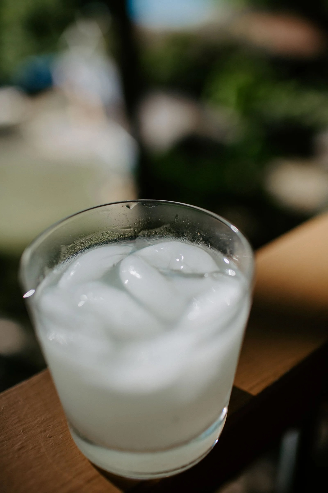

---
tags:
  - beverages
  - drinks
  - By Mike Beihl
author: Mike Beihl
source:
---

# Keto Margarita

## Ingredients

- 2 oz tequila
- 1 oz brandy
- 2 oz lime juice
- Swerve simple syrup
- salt on rim on ice

## Instructions

1. Salt the rim of the glass.
2. Add ice.
3. Add tequila, brandy, and lime juice.
4. Stir in Swerve-based simple syrup.
