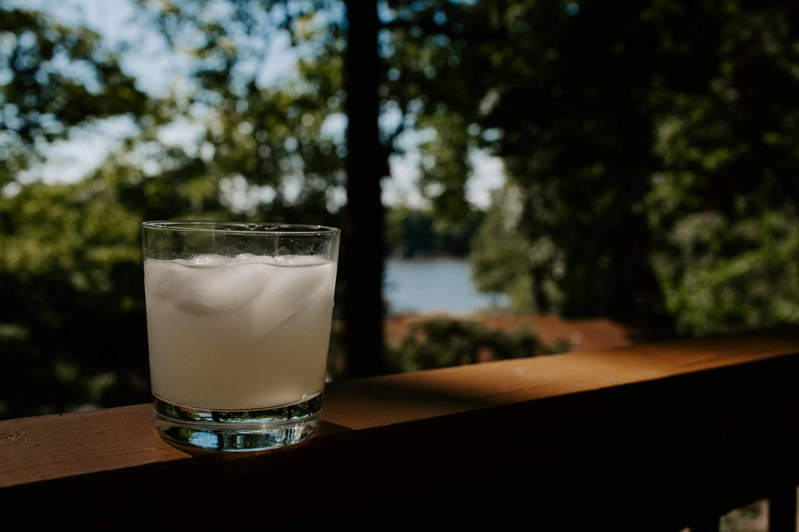

---
tags:
  - beverages
  - drinks
author: Mike Beihl
source:
---

# Mike’s Gin Fizzy

## Ingredients

- One Yeti Rambler
- 3/4 filled with ice
- 2 shots of good gin
- 3/4 shot of organic lime juice
- 3/4 shot of organic lemon juice
- Top off with club soda
- Optional: splash of simple syrup made with Swerve

## Instructions

1. Add ice to the Yeti Rambler.
2. Add gin, lime juice, lemon juice, and club soda.
3. Add optional splach of simple syrup.
