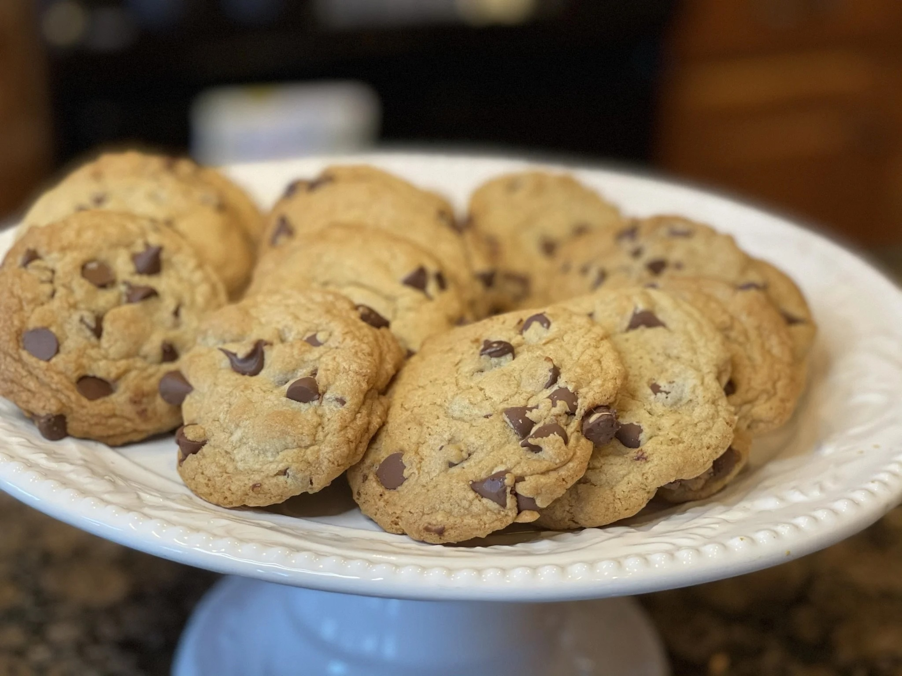

---
tags:
  - desserts
  - sweets
author:
source:
---

# Chocolate Chip Cookies

\

## Ingredients

- 1 ½ cup sugar
- 2 ¼ cup light brown sugar
- 1 cup corn oil
- 2 sticks Margarine
- 4 large eggs
- 1 Tbsp vanilla
- 1 Tbsp salt
- 1 Tbsp soda
- 6 cup flour
- 1 package chocolate chips

## Instructions

1. Preheat the oven to 375˚ F.
2. Blend sugar, light brown sugar, corn oil, Margarine, and eggs.
3. Add vanilla, salt, and soda.
4. Beat for 3 mins.
5. Add flour 1 cup at a time.
6. Add chocolate chips and blend well.
7. Make into balls the size of walnuts.
8. Bake on a greased cookie sheet at 375˚ F for 10-12 mins.
