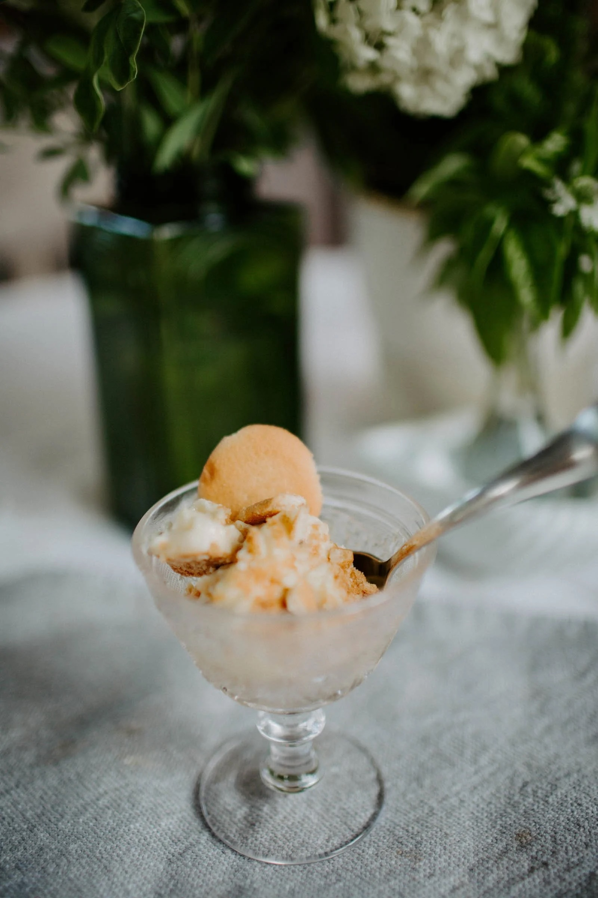

---
tags:
  - desserts
  - sweets
  - By Katy Perko
author: Katy Perko
source:
---

# Katy’s Banana Pudding

## Ingredients

- one 5.1 oz package Jell-O vanilla pudding
- 1 3/4 cups milk
- 1 can sweetened condensed milk
- 8 oz heavy cream
- 1 box vanilla wafers
- 4 bananas sliced into 1/4-inch slices

## Instructions

1. In a small bowl, add vanilla pudding and milk. Whisk for 2 minutes to mix well.
2. Add sweetened condensed milk. Mix well.
3. Add heavy cream. Mix well.
4. Place about 1/4 of the vanilla wafers in bottom of a glass baking pan or casserole dish. Throw in any large crumbled piece you have.
5. Layer 1/3 of the banana slices over top of vanilla wafers.
6. Cover with 1/3 of pudding mixture.
7. Repeat layers twice.
8. Crumble wafers over top for topping.
9. Store, covered, in the refrigerator, for at least 2 hours, to chill, or until ready to serve.
