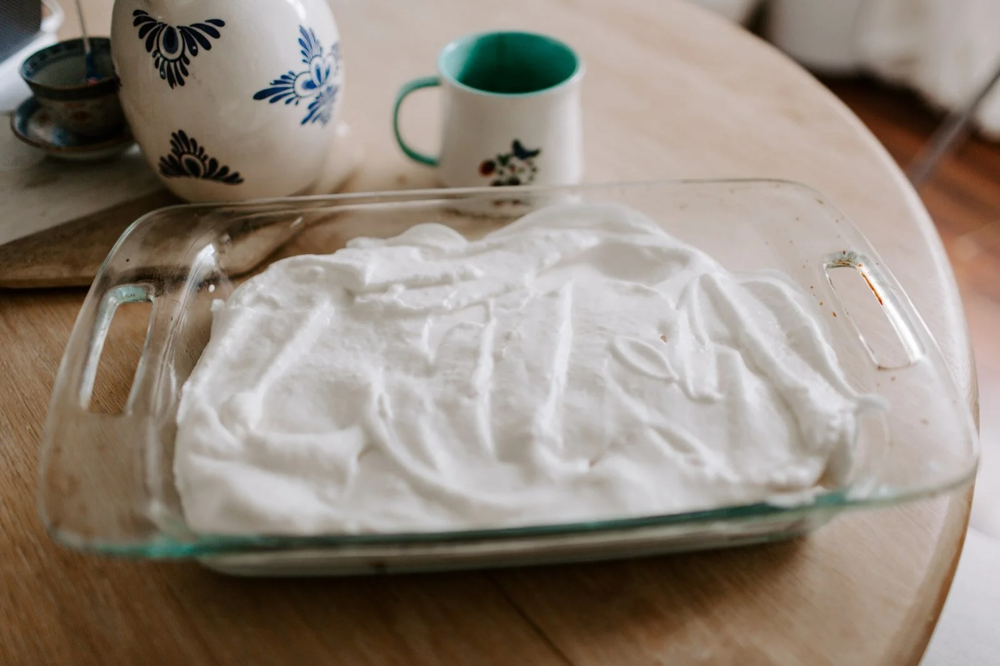

---
tags:
  - desserts
  - sweets
author: Krista Rich
source:
---

# Protein Marshmallows

\

## Ingredients

- 8 egg whites
- 2 scoops gelatin or 22 grams (Perfect Supplements)
- 1/4 cup water
- 1/2 cup organic powdered sugar, cane sugar, honey, maple syrup
- Dash of Vanilla

## Instructions

1. Whip egg whites with a high speed mixer until they form a white foamy peak.
2. Bloom gelatin by sprinkling evenly over 1/4 cup water in small saucepan, make sure there aren’t any clumps! Once thickened, heat it until melted.
3. Once melted, add 1/2 cup organic powdered sugar or anything you prefer in terms of a sweetener. At this time also add vanilla or any other flavoring you prefer.
4. Slowly pour the gelatin mixture into the egg white fluff while mixing.
5. Once it’s combined transfer the marshmallow fluff into a glass dish and put it in the fridge for a couple hours.
6. Cut the now hardened fluff into squares and drop into any of your favorite hot drinks! Also a perfect treat for a toddler!
