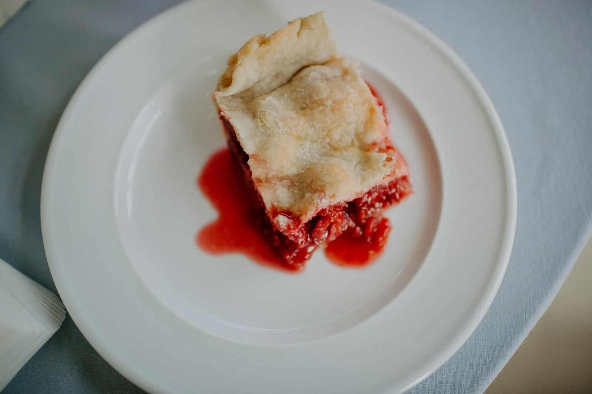

---
tags:
  - desserts
  - sweets
  - By Sherry Beihl
author: Sherry Beihl
source:
---

# Red Raspberry Pie

## Ingredients

Original recipe yields 8 servings. Use with****[**Jan’s Pie Crust**](https://masoncountry.net/recipes/jans-pie-crust?rq=pie)

- 4 cups raspberries (frozen or fresh)
- 1 cup white sugar (1/2 c Swerve and 1/2 c regular sugar)
- 1 Tbsp cornstarch (or 2 1/4 Tbsp tapioca)
- 1 Tbsp lemon juice
- 1/4 tsp ground cinnamon
- 1/8 tsp salt
- 4 tsp butter
- 1 Tbsp half-and-half cream

## Instructions

1. Preheat oven to 425 degrees F
2. Mix together the raspberries, sugar, cornstarch, lemon juice, cinnamon, and salt until raspberries are well-covered.
3. Pour into 9 or 10-inch pastry shell. Dot with butter; add top crust and crimp edge.
4. Make slits in the top crust and brush with cream. Bake in the preheated oven for 15 minutes to set the crust. Reduce heat to 375 degrees F and bake until crust is golden and filling is bubbly, about 25 minutes more. Allow pie to cool completely before serving.
