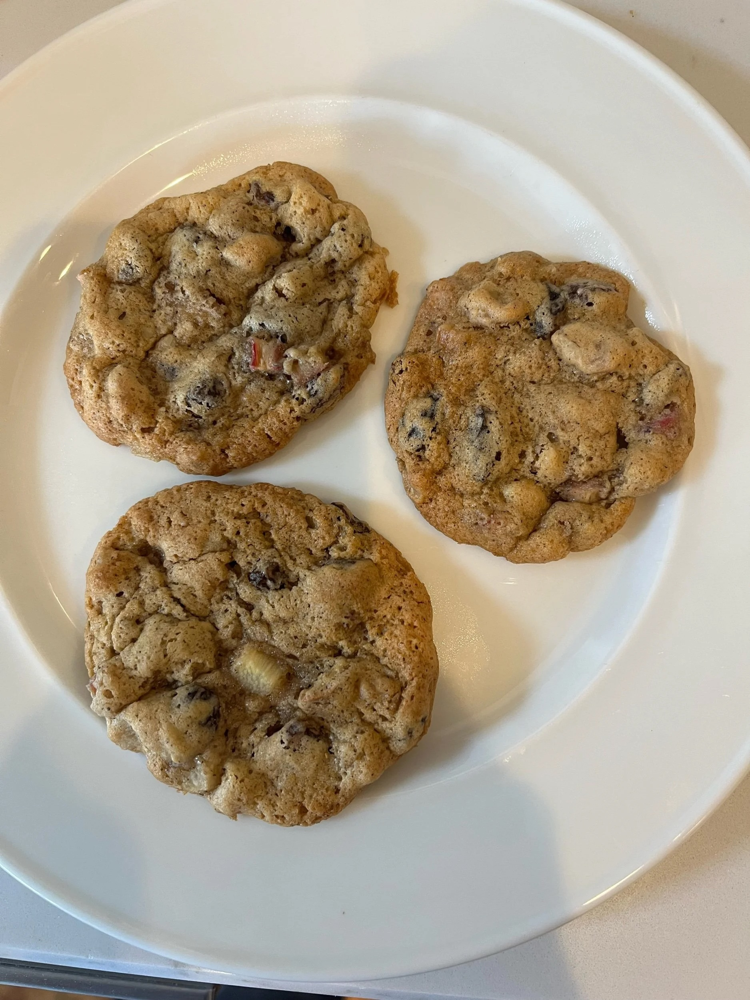

---
tags:
  - desserts
  - sweets
author: Janet Mason
source:
---

# Rhubarb Cookies

## Ingredients

- 1 1/3 cups brown sugar
- 1/2 cup shortening
- 1 egg
- 2 cups flour
- 1/2 teaspoon salt
- 1 teaspoon cinnamon
- 1 teaspoon cloves
- 1/2 teaspoon nutmeg
- 1 teaspoon soda
- 3 Tablespoons milk
- 1/2 cocunut
- 1 cup raisins
- 1 cup chopped rhubarb
- 1 cup chopped nuts

## Instructions

1. Preheat oven to 350 degrees Fahrenheit.
2. Combine brown sugar, shortening and egg together.
3. Combine all dry ingredients.
4. Add alternately with milk to sugar mixture.
5. Mix in the coconut, raisins, rhubarb, annd nuts.
6. Grease a baking sheet.
7. Bake at 350 degrees Fahrenheit for 12-15 minutes.
