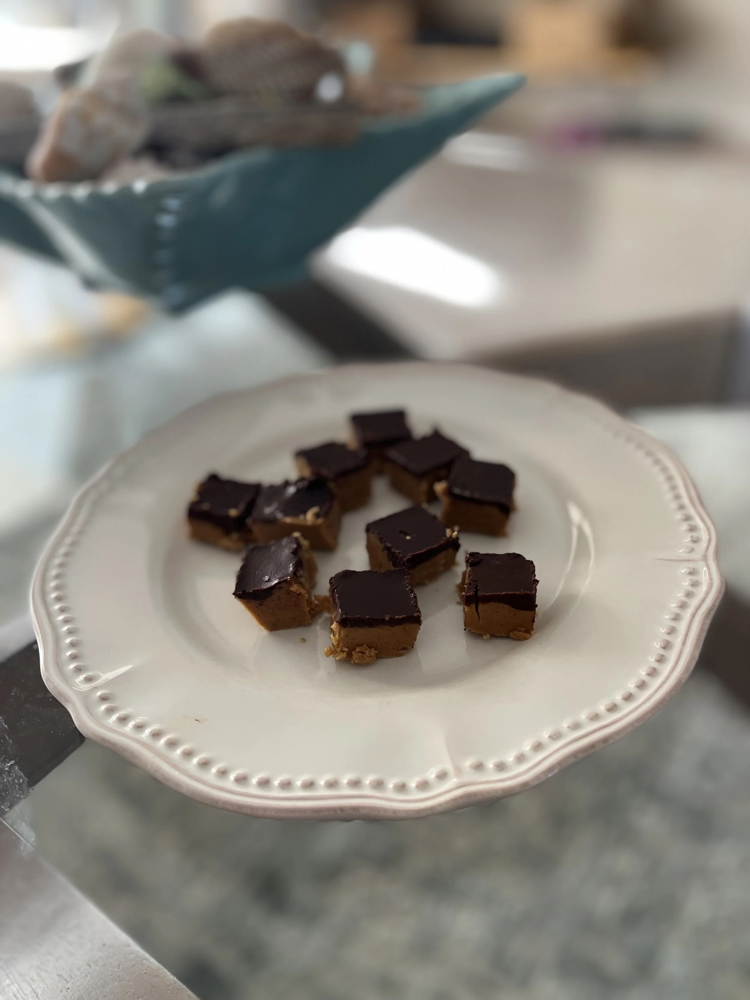

---
tags:
  - desserts
  - sweets
  - By Sherry Beihl
author: Sherry Beihl
source:
---

# Sherry’s Peanut Butter Bars

## Ingredients

### Peanut Butter Mixture

- 3/4 cups (170.3g) butter, melted
- 3/4 cups (170.19) organic peanut butter, melted
- 1/2 cups (120g) Swerve sweetener
- 1 tsp vanilla extract
- 2 cups (240g) peanut flour (roasted, defatted) i use pb fit
- 1/4 tsp salt

### Chocolate Glaze

- 3 oz (859) sugar-free dark chocolate, chopped
- 2 Tbsp butter (28.49)
- 1 tsp Swerve (maybe)
- coarse salt - sprinkle over top

## Instructions

1. Melt the butter and peanut butter together in the microwave for about a minute.
2. Combine with Swerve, vanilla extract, peanut flour, and salt.
3. Pat down in a 9x9 pan.
4. To create the chocolate glaze, melt the chocolate and butter in the microwave.
5. Pour glaze over top of peanut butter
6. Chill till begins to harden and sprinkle with coarse salt.

## Notes

If I use 85% dark chocolate I don’Tbsp add tsp Swerve. If I use 100% dark chocolate, I will add Swerve.

If I use organic peanut butter, I don’Tbsp add all of the PB fit. Stir and see if it gets dry. You don’Tbsp want it to be dry and crumbly.
