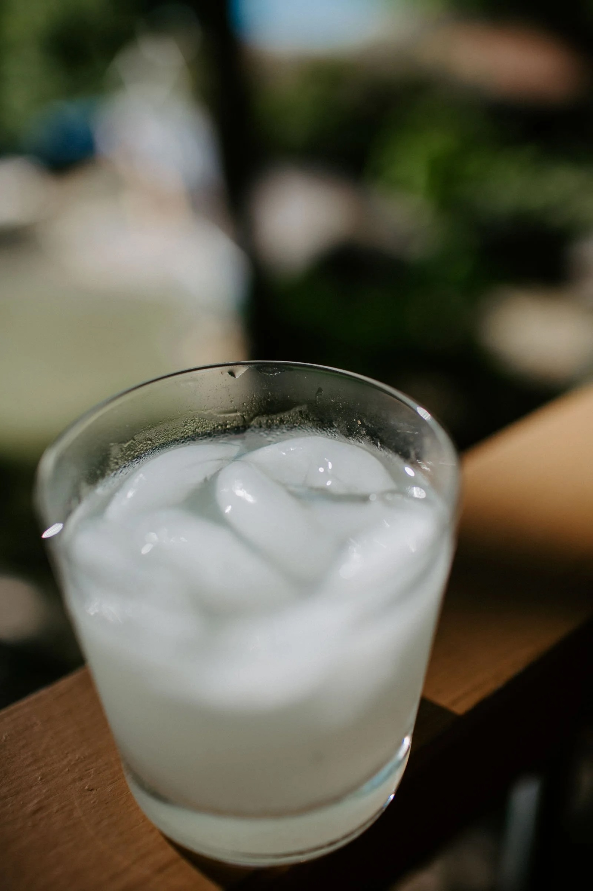

---
tags:
  - beverages
  - drinks
author: Mike Beihl
source:
---

# Keto Margarita

## Ingredients

- 2 oz Tequila
- 1 oz Brandy
- 2 oz Lime juice
- Swerve simple syrup
- Salt on rim on ice

## Instructions

1. Salt the rim of the glass.
2. Add ice.
3. Add tequila, brandy, and lime juice.
4. Stir in swerve-based simple syrup.
