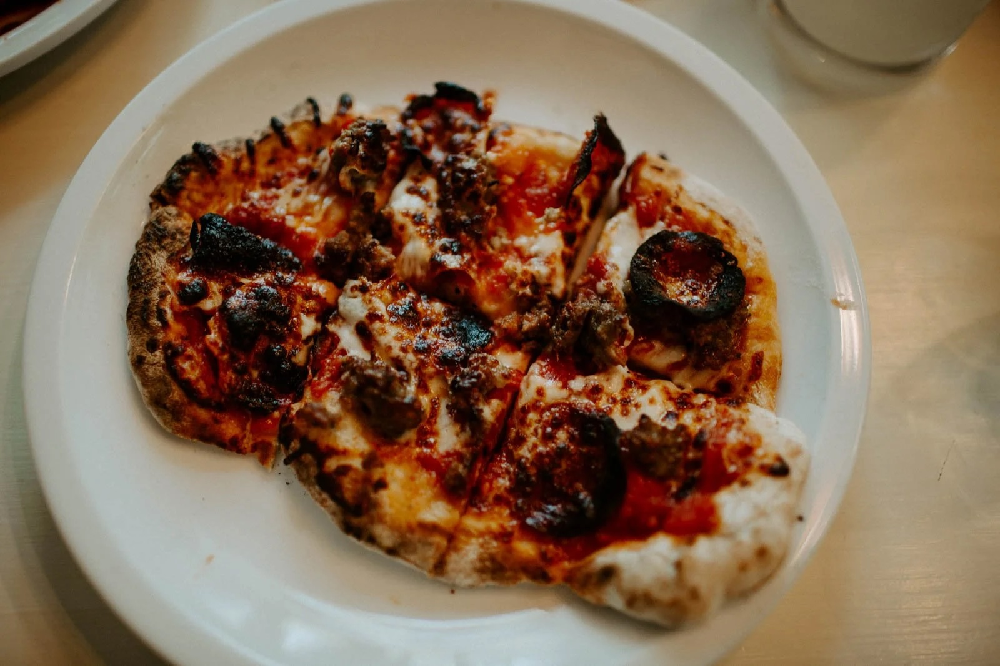

---
tags:
  - main-course
  - entree
  - By Sherry Beihl
  - By David Beihl
author: Sherry Beihl, David Beihl
source:
---

# Sausage Mozzarella Pizza

## Ingredients

### Pizza Dough

- 3 1/3 cups all-purpose flour, plus extra for dusting
- 1/4 cup whole-wheat flour
- 1 package quick-rise yeast
- 1 Tbsp sugar
- 1 Tbsp kosher salt
- 1 1/4 cups warm water, plus extra as needed
- 2 Tbsp olive oil, plus extra as needed

### Pizza Sauce

- 1/4 cup olive oil
- 5 cloves garlic, minced
- 1 can crushed tomatoes
- 1 tsp dried basil
- 3/4 tsp dried oregano
- 1/4 tsp dried thyme
- 1/4 tsp freshly ground pepper
- 1 1/2 - 2 Tbsp red wind vinegar
- kosher salt

### Pizza Toppings

- sausage
- shredded mozzarella
- pepperoni

## Instructions

### Pizza dough

1. In a food processor, combine flours, yeast, sugar, and salt.
2. Pulse to mix the ingredients
3. With the motor running, add the water and olive oil in a steady stream and then pulse until the dough comes together in a rough mass, about 12 seconds.
4. If the doug does not form into a ball, sprinkle 1-2 tsp of water and pulse again unitl a rough mass forms.
5. Let the dough rest for 5-10 mins.
6. Process the dough again for 25-30 seconds, steadying the top of the food processor with one hand. The should be tacky to the touch but not sticky.
7. Transfer the dough to a lightly floured work surface and form into a smooth ball.
8. Place the dough in a large oiled bowl, turn to coat with oil, and cover with plastic wrap. Let the dough rise in a warm place until doubled in bulk an dspongy , about 1 1/2 hours.
9. Turn the dough out onto a lightly floured work surface, punch it down, and shape into a smooth cylinder.
10. Divide into 2 equal pieces. Shape eache piece into a smooth ball, dusting with flour only if the dough becomes sticky.
11. Cover both balls of dough with a clean kitchen towel and let rest for 10 minutes before proceeding with the rest of the recipe.

### Pizza Sauce

1. In a small frying pan, over medium heat, warm the olive oil.
2. Add the garlic and cook, stirring frequently, until fragrant, 1-2 mins. Do not let it scorch or garlic will taste bitter.
3. In a bowl, stir together the garlic-oil mixture, tomatoes, dried basil, oregano, thyme, pepper, 1/3 cup water, and 1 1/2 Tbsp of vinegar.
4. Season to taste with salt and additional vinegar.

### Pizza

1. Start your Ooni pizza oven - allow for 10 minutes of preheating.
2. Brown sausage in pan.
3. Form the pizza dough into a circle.
4. Add Sauce and decorate with ingredients.
5. Add pizza into pizza oven, spinning every 5-10 seconds. Pizza should be done in 60 seconds.
