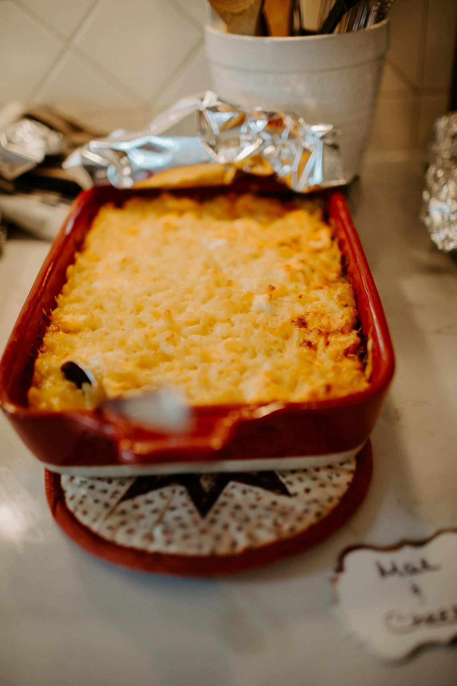

---
tags:
  - main-course
  - entree
  - By Krista Rich
author: Krista Rich
source:
---

# Wedding Casserole

## Ingredients

- 3 cups coocked chicken breasts
- 1/2 can milk (milnot)
- 2 cups cooked rice (uncle ben’s converted)
- 2 tsp lemon juice
- 1 tsp salt
- 1, 8 oz can water chestnuts, sliced
- 3 hard boiled eggs, sliced
- 1 can cream of chicken soup
- 1 cup mayonaise (not miracle whip)
- 1 Tbsp grated onion

## Instructions

1. Mix above ingredients.
2. Grease a large casserole dish.
3. Place mixed ingredients
4. Top with 1/2 cups slivered almonds
5. Cover with a 3/4 stick of buterr Rice Krispies absorbed.
6. Bake at 350 degrees Farenheit for 30 mins.
