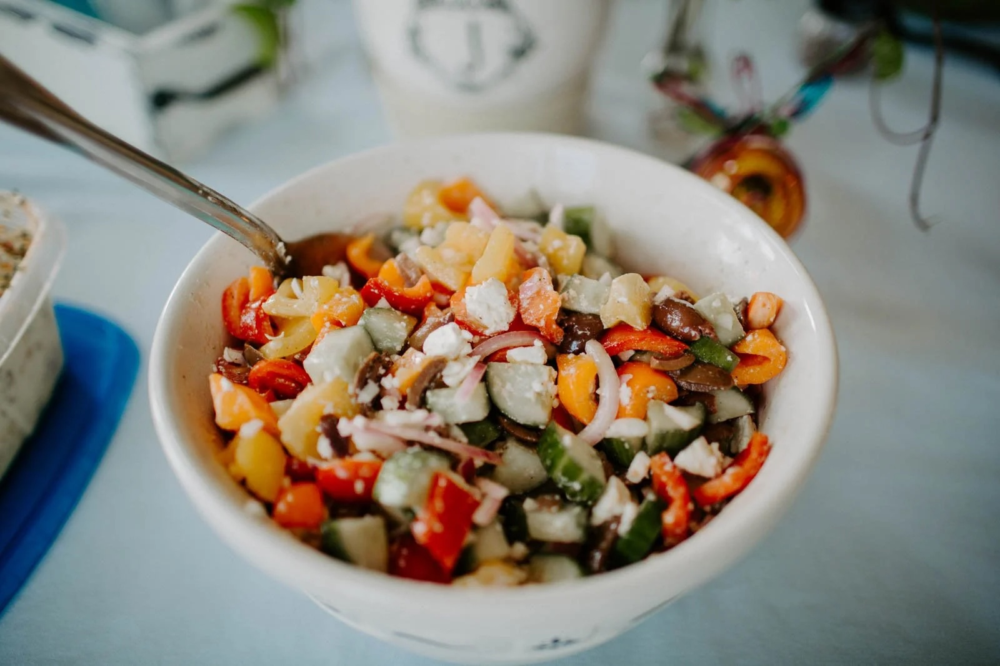

---
tags:
  - sides
  - soups
  - By Sherry Beihl
author: Sherry Beihl
source:
---

# Greek Salad

## Ingredients

### Salad

- 1 yellow pepper, chopped
- 1 orange pepper, chopped
- 1 red pepper, chopped
- 1/2 medium red onion, chopped
- 2 cucumbers, chopped
- 1/4 - 1/2 cups kalamata olives
- cherry tomatoes, halved
- large chunk of feta (cut in cubes or crumbled)

### Dressing

- 1/2 c olive oil
- little less than 1/4 c of red wine vinegar
- salt
- pepper
- greek seasoning if you have it!

## Instructions

1. Combine salad ingredients together in a large bowl.
2. In a separate dish, combine dressing ingredients.
3. When dressing is mixed, add to the salad.
