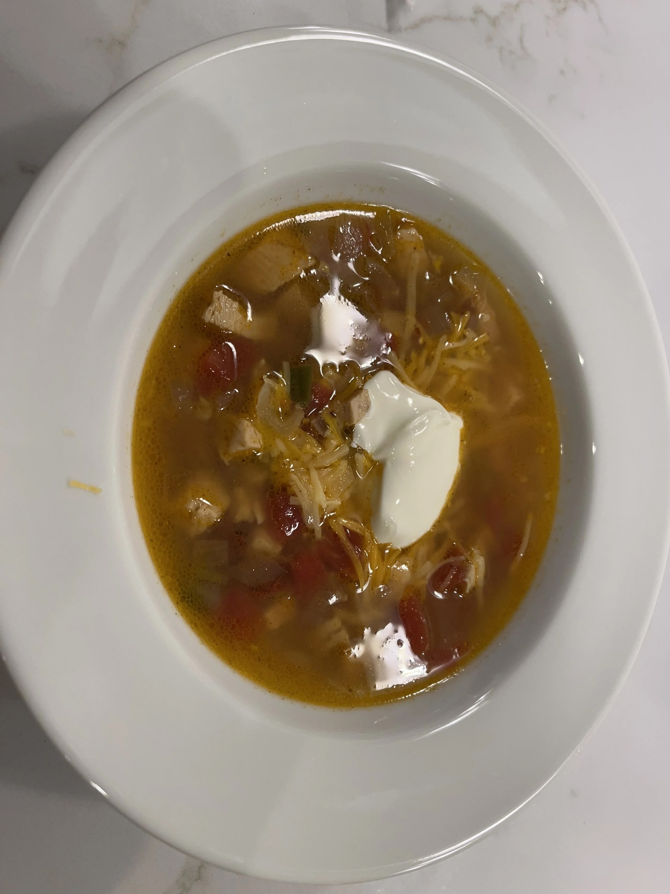

---
tags:
  - sides
  - soups
  - By Julie Mason
author: Julie Mason
source:
---

# Julie’s Tortilla Soup

## Ingredients

- 1-2 Tbsp canola oil
- 1 large onion, diced
- 3 garlic cloves, minced (or 1/2 tsp garlix powder)
- 1 lb chicken breasts or rottiserie chicken, cooked
- 2 tsp salt
- 1 tsp pepper
- 1 tsp chili powder
- 1 tsp cumin
- 1 jalapeno pepper (remove seeds if you do not like spicier foods)
- 6 cups chicken broth
- 1 (14.5 oz) can fire roasted diced tomatoes with chilis
- cilantro

## Instructions

1. In a large pot, cook the chicken.
2. While cooking, prepare your jalapeno.
3. Add your chicken broth to the pot.
4. Add ingredients.
5. Serve with avocado slices, mexican cheese, sour cream, and fritos.
